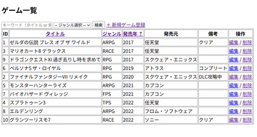
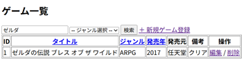

# Spring Boot製ゲーム管理アプリ

TODOアプリの変形である。学習用

---

## 主な機能

- ユーザー認証（ログイン／ログアウト）
- ゲームの登録（タイトル、ジャンル、進行状況）
- ゲーム一覧表示
- キーワード検索（タイトル／ジャンル）
- ゲーム情報の編集・削除

---

## 使用技術

| 分類 | 技術 |
|--------|----------------|
| バックエンド | Spring Boot |
| フロント | Thymeleaf, HTML, CSS |
| データベース | H2 Database |
| ビルド管理 | Maven |

---

## 画面イメージ

| 画面 | 説明 | 画像 |
|--------|----------|--------|
| ログイン画面 | ユーザー認証 |  |
| マイページ画面 | ホーム |  |
| ゲーム一覧画面 | プレイ中／プレイ済の確認 |  |
| ゲーム登録画面 | ゲームの追加登録 |  |
| 検索結果画面 | タイトル／ジャンル検索 |  |

---

## 実行
- mvn spring-boot:run

- http://localhost:8080

---

## ライセンス
教育目的で作成されたもので、第三者による利用や再配布はご遠慮ください。
